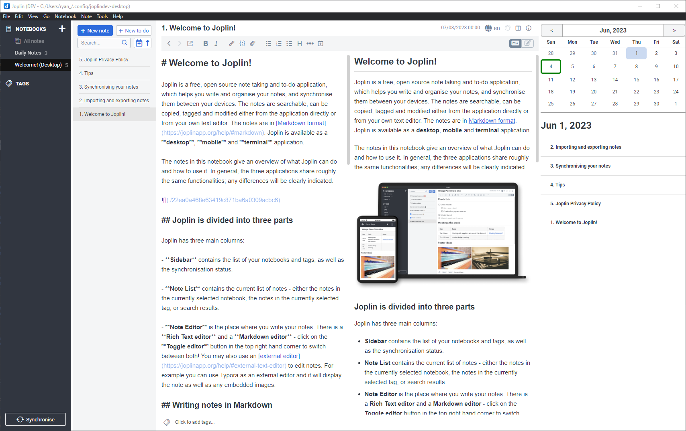

# 📅 Joplin Calendar Plugin

This plugin for [Joplin](https://joplinapp.org/) adds a simple calendar which also helps track notes created and modified each day.

# ⭐ Features

- The plugin includes a **calendar** and a **notes list**.

## 📆 Calendar

- Clicking on a calendar date shows the notes created or updated on that date.
- Clicking on the '<' and '>' buttons above the calendar moves between months.
- Clicking on the '<' and '>' buttons above the calendar _while holding `ctrl`_ moves between years.
- Calendar dates have dots beneath them indicating the number of notes written on that day.
  - Each dot represents 2 notes created, up to a maximum of 4 dots.

> [!Tip]
> The create date and updated date for a note can be manually change by clicking on the "🛈" button.

## 🗒️ Notes List

- The notes list shows notes created on the specified date.
- The notes list can show notes updated on the specified date.
  - This must be enabled in the settings.
- The notes list can show notes related to the specified date. These are notes that have the date in the title of the note.
  - This must be enabled in the settings.
  - The Joplin date format is used when searching for related notes.
- Navigate to the notes by clicking on the titles in the notes list.
- Clicking on the '<' and '>' buttons above the notes list moves days.
- Clicking on the '<' and '>' buttons above the notes list _while holding `ctrl`_ moves between days with notes.
- Clicking the `today` button brings back the calendar focus to the current day.
- Notes can be sorted by time of creation, or alphabetically. The sort direction can also be changed.

## ⌨️ Keyboard Shortcuts

### Joplin Wide

| Action              | Default Shortcut  |
| ------------------- | ----------------- |
| Toggle the Calendar | CmdOrCtrl+Shift+` |

### After clicking on Calendar

- Use the arrow key to move between dates.
- Use Ctrl to jump between days with notes.
  - Use Ctrl+Left or Ctrl+Up to jump to the nearest date in the past with a note.
  - Use Ctrl+Right or Ctrl+Down to jump to the nearest date in the future with a note.

### After clicking on the Note List

- Use up and down arrow keys to select notes.

## 🛑 Limitations

- Related notes is still an experimental feature - it will negatively impact performance with larger note books.
- When searching for the nearest note with Related Notes ON, only related notes within the closest 120 days will be checked.

# ⚙️ Development

## Building the plugin

The plugin is built using Webpack, which creates the compiled code in `/dist`. A JPL archive will also be created at the root, which can be used to distribute the plugin or test locally by loading it into Joplin.

To build the plugin, simply run `npm run dist`.
Alternatively, to automatically rebuild the plugin on source code changes, run `npm run watch`

## Testing the plugin

Jest is used for unit tests. Run them with: `npm run test`.

## Updating the plugin framework

To update the plugin framework, run `npm run update`.

In general this command tries to do the right thing - in particular it's going to merge the changes in package.json and .gitignore instead of overwriting. It will also leave "/src" as well as README.md untouched.

The file that may cause problem is "webpack.config.js" because it's going to be overwritten. For that reason, if you want to change it, consider creating a separate JavaScript file and include it in webpack.config.js. That way, when you update, you only have to restore the line that include your file.
